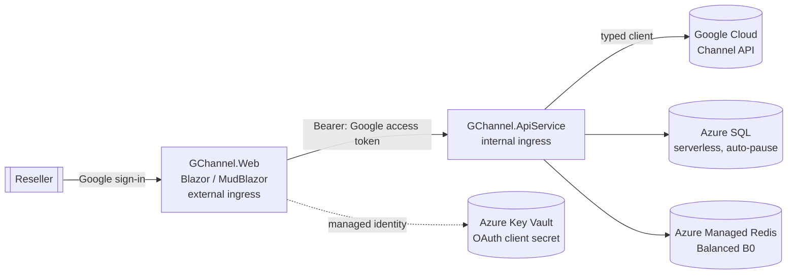

# GChannel

A .NET 10 / Blazor dashboard for Google distributors and resellers. Users sign in with their
Google account and the UI abstracts the **Google Cloud Channel API** behind point-and-click
actions — they never see the underlying REST calls.

Built with **.NET Aspire** so the front end and back-end services run as two independently
scalable **Azure Container Apps**, with **Azure SQL (serverless)** storage and **Azure Managed
Redis** caching. Deployment is handled by the **Azure Developer CLI (`azd`)**.

## Solution layout

```
GChannel.slnx                     # solution (root)
azure.yaml                        # azd → Aspire AppHost
src/
  GChannel.AppHost                # Aspire orchestrator: resources + wiring
  GChannel.ServiceDefaults        # OpenTelemetry, health checks, resilience
  GChannel.Shared                 # DTOs/contracts shared by Web + API
  GChannel.ApiService             # Web API + Google Channel client (internal ingress)
  GChannel.Web                    # Blazor (MudBlazor + ApexCharts), Google login (external ingress)
```

### Why two container apps?
`GChannel.Web` (the UI) and `GChannel.ApiService` (the Google integration + data/cache) are
separate Container Apps so they scale independently. The UI is the only one with **external**
ingress; the API service is **internal** and reached over the Container Apps network.

## Architecture



The signed-in user's Google OAuth access token (scope `https://www.googleapis.com/auth/apps.order`)
is forwarded from the Web app to the API service, which uses it to call the Channel API on the
user's behalf.

### Secrets

The Google OAuth **client secret** is stored in **Azure Key Vault** and injected into the Web
container app as a Key Vault *secret reference* — the literal value never appears in the
deployment manifest or as plain-text Container Apps configuration. The Web app reads it through
its **managed identity** (granted `Key Vault Secrets User`). Non-secret settings (client id,
reseller account id) are passed as normal parameters/environment variables.

## Implemented API surface

| UI action | Channel API |
| --- | --- |
| **Accounts → Cloud Identity check** | [`accounts.checkCloudIdentityAccountsExist`](https://docs.cloud.google.com/channel/docs/reference/rest/v1/accounts/checkCloudIdentityAccountsExist) |

Planned next (the structure is ready to grow into these):
`accounts`, `accounts.channelPartnerLinks`, `products`, `products.skus`.

## Prerequisites

- [.NET 10 SDK](https://dotnet.microsoft.com/)
- [Docker Desktop](https://www.docker.com/) (local SQL Server + Redis containers)
- [Azure Developer CLI (`azd`)](https://aka.ms/azd)
- A Google Cloud project with the **Cloud Channel API** enabled and an **OAuth 2.0 Client**
  (Web application). Authorized redirect URI for local dev:
  `http://localhost:<web-port>/signin-google`.
- A Cloud Channel **reseller account id** (`accounts/C0xxxxxxx`).

## Configuration

| Setting | Project | Local dev | Azure |
| --- | --- | --- | --- |
| `Authentication:Google:ClientId` | Web | user-secrets | `GoogleClientId` azd param (env var) |
| `Authentication:Google:ClientSecret` | Web | user-secrets | `GoogleClientSecret` azd param → **Key Vault** |
| `GoogleChannel:AccountId` | ApiService | user-secrets | `GoogleChannelAccountId` azd param (env var) |

In Azure the client secret lives in Key Vault; locally it is resolved from user-secrets, so the
app code reads `Authentication:Google:ClientSecret` the same way in both environments.

### Local secrets

```powershell
dotnet user-secrets --project src/GChannel.Web set "Authentication:Google:ClientId" "<client-id>"
dotnet user-secrets --project src/GChannel.Web set "Authentication:Google:ClientSecret" "<client-secret>"
dotnet user-secrets --project src/GChannel.ApiService set "GoogleChannel:AccountId" "accounts/C0xxxxxxx"
```

## Run locally

```powershell
dotnet run --project src/GChannel.AppHost
```

This starts the Aspire dashboard, spins up SQL Server and Redis containers, and launches both
services. Open the `webfrontend` endpoint from the dashboard.

## Deploy to Azure

```powershell
azd up
```

`azd` provisions the Container Apps environment, **Azure Key Vault**, the serverless Azure SQL
database (`GP_S_Gen5_2`, auto-pause after 60 min, min capacity 0.5) and Azure Managed Redis
(`Balanced B0`), then deploys both container apps. You will be prompted for `GoogleClientId`,
`GoogleClientSecret` and `GoogleChannelAccountId`; the client secret is written to Key Vault and
the Web app's managed identity is granted access automatically. After the first deploy, add the
Web app's public URL plus `/signin-google` to the authorized redirect URIs of your Google OAuth
client.

## Notes / next steps

- Google access tokens expire after ~1 hour. A refresh token is captured (`AccessType=offline`);
  wiring up silent refresh in the API service is the recommended next hardening step.
- `GoogleChannel:AccountId` is required for every Channel API call and is validated at runtime.
- The dashboard figures on the home page are placeholders until the reporting endpoints are added.
