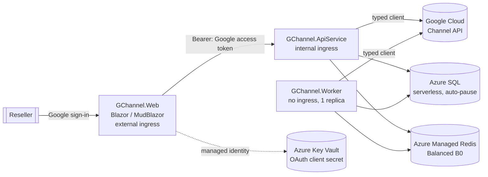

# Architecture

GChannel is built with **.NET Aspire** so the front end, back-end API and background worker run as
three independently scalable **Azure Container Apps**, with **Azure SQL (serverless)** storage and
**Azure Managed Redis** caching.

## Solution layout

```
GChannel.slnx                     # solution (root)
azure.yaml                        # azd → Aspire AppHost
src/
  GChannel.AppHost                # Aspire orchestrator: resources + wiring
  GChannel.ServiceDefaults        # OpenTelemetry, health checks, resilience
  GChannel.Shared                 # DTOs/contracts shared by Web + API
  GChannel.ApiService             # Web API + Google Channel client (internal ingress)
  GChannel.Worker                 # background jobs: refresh, Pub/Sub, read-model sync (no ingress)
  GChannel.Web                    # Blazor (MudBlazor + ApexCharts), Google login (external ingress)
```

## Why three container apps?

`GChannel.Web` (the UI), `GChannel.ApiService` (the Google integration + data/cache) and
`GChannel.Worker` (the scheduled/streamed background jobs) are separate Container Apps so they scale
on independent axes. The UI is the only one with **external** ingress; the API service is **internal**
and reached over the Container Apps network; the worker has **no ingress** at all. Splitting the
workers out lets the API scale on HTTP traffic (and down to zero) while the worker stays pinned at a
single replica — its cluster-wide Redis locks make extra replicas redundant, and `min-replicas = 1`
keeps the Pub/Sub subscriber consuming. The worker reuses the API's client/data/options assemblies via
a project reference; the API still owns schema creation on startup.

## Diagram



The signed-in user's Google OAuth access token (scope `https://www.googleapis.com/auth/apps.order`)
is forwarded from the Web app to the API service, which uses it to call the Channel API on the
user's behalf.

## Token lifecycle (silent refresh)

Google access tokens expire after ~1 hour. To keep sessions working without forcing re-login, the
Web app requests offline access (`AccessType=offline`) so Google also returns a **refresh token**.
At sign-in the access token, refresh token, and the access token's expiry are stored as claims in
the data-protected authentication cookie.

Before each call to the API service, `GoogleTokenProvider` (in the Web app) returns a valid access
token: it reuses the sign-in token until just before it expires, then silently exchanges the
refresh token for a new access token at Google's token endpoint, caching the result in memory per
user. Only short-lived access tokens are ever forwarded to the API service — the long-lived refresh
token never leaves the Web app, so the API service stays a stateless Bearer-token consumer.

## Secrets

The Google OAuth **client secret** is stored in **Azure Key Vault** and injected into the Web
container app as a Key Vault *secret reference* — the literal value never appears in the
deployment manifest or as plain-text Container Apps configuration. The Web app reads it through
its **managed identity** (granted `Key Vault Secrets User`). Non-secret settings (client id,
reseller account id) are passed as normal parameters/environment variables.

## Resilience &amp; throttling (HTTP 429)

The Channel API enforces per-project quotas, so bursts of reads can return **429 Too Many
Requests**. Two layers keep this graceful:

- **Client-side back-off.** Each `CloudchannelService` is created with a custom
  `RetryAfterBackOffHandler` that retries `429` (and transient `503`) responses up to
  `GoogleChannel:MaxRetryAttempts` (default 3). When the response carries a **`Retry-After`** header
  (the Channel API sends one on quota errors) the handler waits exactly that long — capped by
  `GoogleChannel:MaxRetryDelaySeconds` (default 60) — otherwise it falls back to exponential back-off
  with jitter. The handler also widens `ConfigurableMessageHandler.NumTries` (which otherwise caps
  total tries) and the library's default 503-only policy is disabled in favour of this handler.
- **Clean surfacing.** If retries are exhausted, `GoogleApiExceptionHandler` (an `IExceptionHandler`)
  maps the `GoogleApiException` to the same HTTP status (e.g. `429` with a `Retry-After` hint, or
  `403`/`404`) and a `ProblemDetails` body, instead of a generic `500`. A missing access token
  becomes a `401`. The Blazor pages surface these as snackbar errors.

Idempotent reads are also **cached in Redis** (`GoogleChannel:CacheSeconds`, default 300s), so warm
lookups never hit Google — both reducing latency and shrinking the 429 surface.

**Request timeouts.** The shared `AddStandardResilienceHandler` (in `GChannel.ServiceDefaults`) is
configured with a longer **attempt** (60s) and **total-request** (120s) timeout than the framework
default (10s/30s). Calls that fan out to the Channel API can legitimately exceed 30s on a cold start
(credential setup plus exponential back-off retries), so the default would otherwise surface as
*"The operation didn't complete within the allowed timeout of '00:00:30'"*.

**Cloud Identity checks** are additionally **persisted** to Azure SQL (`IdentityCheckLogs`) as an
audit trail. The check endpoint serves the cached result by default; passing `?refresh=true`
(surfaced as the **recheck** button in the UI) bypasses the cache and re-queries Google, then
refreshes the cache. A history endpoint returns the latest result per domain so the UI can show a
"recently checked" list with one-click recheck.

## Catalog correlation &amp; navigation

Catalog resources are cross-linked so a user can pivot between them. The API derives correlation
ids from Google resource names (`products/{product}/skus/{sku}`): a SKU carries its `ProductId`,
and offers/billable-SKUs carry both `SkuId` and `ProductId`. The UI uses these for deep links:

- **Products → Offers** — each SKU row links to `/catalog/offers?sku={skuId}` (offers filtered to
  that SKU).
- **Offers → Products** — the SKU column links to `/catalog/products?product={productId}&sku={skuId}`,
  which auto-expands the product and highlights the SKU.
- **SKU groups → Products / Offers** — each billable SKU links to its product and its offers.

Each table shows the **friendly display name** with the raw id available as a tooltip (and, where a
list previously showed an opaque id such as the Offers page's SKU column, the id is replaced by the
resolved SKU/offer name with the id moved to the tooltip).

This same id-correlation model is the hook for future **customer management** links (e.g. a
customer's entitlements resolving to the products/SKUs/offers shown here).

## Customer management

Customer CRUD is exposed under `/api/customers` (list, get, create `POST`, update `PUT`, delete
`DELETE`). The UI surfaces this as a customers table (`/customers`), a shared create/edit form
(`/customers/new`, `/customers/edit/{id}`), and a detail page (`/customers/{id}`).

- **Cached with invalidation.** Customer list/get are cached in Redis like the catalog reads, but
  because customer data is mutable the cache is **invalidated on every create/update/delete**
  (the list key plus the affected customer key) so the UI never shows stale data after a change.
  Only idempotent purchasable-catalog reads rely on TTL alone.
- **Safe updates.** `UpdateCustomerAsync` sets a field mask
  (`org_display_name,org_postal_address,primary_contact_info,language_code`) so the immutable
  domain and Cloud Identity are never touched; the domain field is disabled in the edit form.
- **Catalog correlation.** The detail page's *Purchasable catalog* section reuses the catalog
  id-correlation model: picking a product lists the customer's purchasable SKUs
  (`listPurchasableSkus`), each of which deep-links to `/catalog/products?product={productId}&sku={skuId}`
  and can expand to its purchasable offers (`listPurchasableOffers`).
- **Cloud Identity cross-link.** The customers table shows whether each customer has a linked Cloud
  Identity (from the `CloudIdentityId` already in the list response — no extra call) and offers a
  per-row **Check** action that deep-links to `/accounts/cloud-identity?domain={domain}`, which
  prefills and runs the check for that domain.
- **Import & provision (§12.2).** Two extra account-level flows sit alongside CRUD.
  `POST /api/customers/import` (`accounts.customers.import`) brings a pre-existing Cloud Identity
  customer into the account before a transfer — it returns the `Customer` **synchronously** (not an
  LRO), so it's a `201 Created` that invalidates the list cache, surfaced as an **Import customer**
  action on the Customers list and the Cloud Identity check page.
  `POST /api/customers/{customerId}/provision-cloud-identity`
  (`accounts.customers.provisionCloudIdentity`) creates a new Cloud Identity for a customer that has
  none — this **is** an LRO, so it returns `202 Accepted` with a `ChannelOperation` (the same §7 mapper)
  and the detail-page action deep-links to the Operations page (`?operation={id}`) to track it.

## Entitlement lifecycle

Entitlements (a customer's subscriptions) are the core selling artefact and are nested under a
customer at `/api/customers/{customerId}/entitlements`. The read paths (list, get, change history,
offer lookup) are cached in Redis like the customer reads; every mutation **invalidates** the
affected customer's entitlement caches (list + the specific entitlement's get/changes/offer keys).

- **Pages.** `/customers/{id}/entitlements` lists entitlements with state chips and a state-change
  actions menu; `/customers/{id}/entitlements/{eid}` shows full detail (commitment/renewal, modify
  seats/offer, lifecycle actions, change history); `/customers/{id}/entitlements/new` is the
  purchase flow.
- **Catalog correlation.** Each entitlement carries the provisioned `productId`/`skuId` and backing
  `offerId`, so rows deep-link to `/catalog/offers?sku={skuId}` and
  `/catalog/products?product={productId}&sku={skuId}`. The purchase and *change offer* flows reuse
  the customer's purchasable SKUs/offers (`listPurchasableSkus`/`listPurchasableOffers`) so the
  eligible offer resolves to the same catalog ids.
- **Friendly names.** Entitlements (and their change history) only carry opaque ids, so the API
  enriches them with human-readable **offer / SKU / product** names resolved from the catalog,
  reusing each resource's `MarketingInfo.DisplayName`. Resolution uses a **fallback chain** so a name
  still appears when an entitlement's specific offer is no longer listed (the common cause of raw
  ids): (1) the offer catalog (`offers.list`) resolves offer + SKU + product in one hit; (2) the
  per-product SKU catalog (`products.skus.list`, fetched once per product with bounded concurrency)
  resolves the SKU/product names by `skuId`; (3) the full product catalog (`products.list`) resolves
  the product name by `productId` as a last resort. The UI shows the friendly name with the raw id as
  a tooltip/secondary caption, and falls back to the id only if every lookup misses (all lookups are
  non-fatal). The dashboard skips step (2) since it only needs product names.
- **Typed parameters.** Seat counts are the `num_units` entitlement parameter; the UI sends them as
  a typed `int64` value (`EntitlementParameterInput.IntValue`) on purchase and `changeParameters`.
- **Long-running operations.** Mutating calls (`create`, `changeOffer`, `changeParameters`,
  `changeRenewalSettings`, `activate`, `suspend`, `cancel`, `startPaidService`) return LROs. Full
  operation polling is deferred (roadmap §7); endpoints return `202 Accepted` with an
  `EntitlementOperation` (`OperationName`, `Done`, `Error`). The UI reports *completed* when Google
  finishes inline, otherwise *submitted — processing*, then reloads so the change appears once
  provisioning finishes.

## Transfers

Transferring an existing subscription into the reseller is modelled like the entitlement lifecycle —
it hangs off a customer and reuses the same catalog id-correlation. The read paths
(`accounts.listTransferableSkus`, `accounts.listTransferableOffers`) are cached in Redis; the two
mutating calls invalidate the customer's transferable-SKU and entitlement-list caches so the
transferred subscriptions show up once provisioning finishes.

- **Endpoints.** Under `/api/customers/{customerId}`: `GET /transferable-skus`,
  `GET /transferable-offers?productId={productId}&skuId={skuId}`, `POST /transfer-entitlements`,
  and `POST /transfer-entitlements-to-google` (the last two return `202 Accepted` with the LRO).
- **Page.** `/customers/{id}/transfer` lists transferable SKUs (eligibility chip; ineligible SKUs
  are disabled), lazy-loads transferable offers when a SKU panel is expanded, and builds a basket of
  offers to transfer with per-line seats + purchase order and an optional transfer auth token. It is
  reachable from both the **Customer detail** and **Entitlements** page headers.
- **Catalog correlation.** Transferable SKUs/offers carry the same `productId`/`skuId`/`offerId` as
  everywhere else and resolve their friendly **product / SKU / offer** names from the offer catalog
  (reusing `MarketingInfo.DisplayName`), so a transfer resolves to the same catalog ids as a
  purchase. The `transferable-offers` lookup is scoped to a product/SKU pulled from the chosen SKU.
- **Long-running operations.** Both `transferEntitlements` and `transferEntitlementsToGoogle` return
  LROs (handled exactly like the entitlement mutations above — `202 Accepted` +
  *completed*/*submitted — processing*). The basket UI drives the standard `transferEntitlements`
  reseller flow; `transferEntitlementsToGoogle` (handing a subscription back to direct Google
  billing) is wired through the API for completeness.

## Channel partner links (n-tier / distributor)

A distributor links a downstream reseller (a *channel partner*) to their account; customers can then
be owned by that partner. Links live at the **account** level (not under a customer), so they are
rooted off `/api/channel-partner-links` and managed by `IGoogleChannelClient`'s
`ListChannelPartnerLinksAsync` / `GetChannelPartnerLinkAsync` / `CreateChannelPartnerLinkAsync` /
`UpdateChannelPartnerLinkStateAsync` / `ListChannelPartnerCustomersAsync`, plus the n-tier customer
CRUD `GetChannelPartnerCustomerAsync` / `CreateChannelPartnerCustomerAsync` /
`UpdateChannelPartnerCustomerAsync` / `DeleteChannelPartnerCustomerAsync` /
`ImportChannelPartnerCustomerAsync`.

- **Endpoints.** `GET /api/channel-partner-links` (list), `POST /api/channel-partner-links` (invite),
  `GET /api/channel-partner-links/{id}` (get), `PUT /api/channel-partner-links/{id}/state` (change
  state) and the partner-customer routes nested under `/{id}/customers`:
  `GET` (list), `GET /{customerId}` (get), `POST` (create), `PUT /{customerId}` (update),
  `DELETE /{customerId}` (delete) and `POST /customers/import` (import a Cloud Identity customer).
  Reads are cached in Redis for
  `CacheSeconds`; the list + per-link caches are invalidated on create/patch. List/get use the **FULL**
  view so the partner's Cloud Identity info comes back for display.
- **Lifecycle.** `create` always starts the link in the `INVITED` state; the partner accepts via the
  output-only `InviteLinkUri`. `patch` is scoped by `update_mask = channel_partner_link.link_state`
  (the only mutable field), driving the Activate/Suspend control. Unlike entitlements/transfers, both
  `create` and `patch` return the **link resource directly** (not LROs), so the UI updates immediately.
- **Pages.** A **Partner links** list (`/channel-partner-links`), an **Invite partner** form
  (`/channel-partner-links/new`) and a **link detail** page (`/channel-partner-links/{id}`) under a new
  **Channel partners** nav group. The detail page shows the invitation URI, partner Cloud Identity,
  state control, and the customers the partner owns — with **Add customer** / **Import customer**
  actions and per-row **Edit** / **Delete**. Create/edit reuse `CustomerForm.razor` (made `linkId`-aware
  via a `?linkId=` query param so saves/loads route through the partner endpoints and return to the
  link); import uses an inline dialog (domain / Cloud Identity id / primary admin email + overwrite).
  Partner-customer mutations invalidate the `channel-partner-links:{linkId}:customers[:{customerId}]`
  caches and let the read-model sync converge; all partner-customer calls return the `Customer`
  directly (no LROs).
- **Correlation.** A link's short id is exactly a customer's `ChannelPartnerId` (§2): the
  **Customer detail** page shows a *Channel partner* row linking to the owning link (or "Direct (no
  partner)"), and the **link detail** page lists the partner's customers via
  `channelPartnerLinks.customers.list`, each row linking back to the customer. The home **Channel
  links** card counts links via a cheap account-level `channelPartnerLinks.list` (BASIC view) folded
  into the dashboard *overview* phase.

## Repricing (rebilling margin)

A reseller can mark up or discount what a customer is billed, and a distributor can do the same for a
whole downstream channel partner. Both are modelled as *repricing configs* and share the contracts in
`GChannel.Shared/Contracts/Repricing.cs` (`RepricingConfig`, `RepricingConfigsResult`,
`SaveRepricingConfigRequest`, plus `RebillingBases` / `RepricingGranularities` constant classes) and
the `IGoogleChannelClient` methods `ListCustomerRepricingConfigsAsync` /
`CreateCustomerRepricingConfigAsync` / `UpdateCustomerRepricingConfigAsync` /
`DeleteCustomerRepricingConfigAsync` and the four `…ChannelPartnerRepricingConfig…` equivalents.

- **Endpoints.** `GET|POST /api/customers/{customerId}/repricing-configs`,
  `PUT|DELETE /api/customers/{customerId}/repricing-configs/{configId}` and the matching
  `/api/channel-partner-links/{linkId}/repricing-configs[/{configId}]`. Reads are cached in Redis for
  `CacheSeconds`; the list cache is invalidated on create/update/delete.
- **Config shape.** A config carries the effective invoice month (current or future), a percentage
  adjustment (positive marks up, negative discounts, carried over the wire as a `GoogleTypeDecimal`
  string) and a rebilling basis (`COST_AT_LIST` or `DIRECT_CUSTOMER_COST`). Conditional overrides are
  surfaced read-only as a count.
- **Granularity.** Customer configs use **entitlement granularity** — each targets one of the
  customer's entitlements (required) — so the create form populates its entitlement picker from
  `entitlements.list` (§3). Channel partner configs use **channel-partner granularity** and reprice
  the whole reseller, so no entitlement is selected.
- **Pages.** **Customer repricing** (`/customers/{id}/repricing`) and **Channel partner repricing**
  (`/channel-partner-links/{id}/repricing`), each with an inline create/edit form and a delete action,
  reached via a **Repricing** action on the customer-detail and link-detail pages.
- **Correlation.** Each customer config row links its targeted entitlement back to the entitlement
  detail page (§3). Like channel partner links, `create`/`patch` return the **config resource
  directly** (not LROs), so the UI updates immediately.

## Home dashboard (derived summary)

The home page (`/`) is backed by a single internal `GET /api/dashboard/summary` endpoint. There is
no Channel API reporting endpoint to call (`accounts.reports.*` / `accounts.reportJobs.*` are
**deprecated** in `v1`), so `GetDashboardSummaryAsync` derives the figures by aggregating the
read paths:

- **Customers** (`accounts.customers.list`) drives the customer count and the *customers onboarded*
  area chart, which buckets customers by their create month across the **full available history**
  (earliest customer month → now). The chart carries a sortable `MonthKey` (yyyy-MM) + year per bucket
  so the home page can offer From/To month selectors to view the whole period or any sub-range.
- **Entitlements** (per-customer `entitlements.list`) drives the active / trial / suspended counters,
  the active-seat total (`num_units`), and the *product mix* donut (active entitlements grouped by
  product, top 8). Product names are resolved from a product-id→name map seeded from the full
  `products.list` catalog (authoritative, so it covers products whose specific offer is no longer
  listed) and supplemented from `offers.list`, which also yields the offer-id→display map used by the
  entitlement pages. The donut therefore shows friendly names instead of opaque product/sku ids. On the
  read-model path the mix is additionally **split into direct vs indirect** (by `OwningLinkId`): the UI
  shows a *Direct* and a *Via resellers (indirect)* donut. The live path enumerates only direct
  customers, so it fills the direct mix only.

The aggregation makes N+1 Channel API calls (customers + per-customer entitlements). The per-customer
entitlement lists run with **bounded parallelism** (`GoogleChannel:DashboardMaxConcurrency`, default 6)
under a **time budget** (`GoogleChannel:DashboardBudgetSeconds`, default 45s) that is
kept comfortably below the HTTP client's per-attempt timeout, so the endpoint always responds in time
(and its Redis cache can warm up) instead of being cut off mid-flight and retried. The Channel API
enforces a **per-minute request quota** ("ListEntitlements requests per minute"), so on large estates
a burst of `entitlements.list` calls would otherwise blow past it and trigger a wave of **HTTP 429s**.
Two layers prevent that: (1) the calls are **proactively paced** to
`GoogleChannel:DashboardRequestsPerMinute` (default 60 ⇒ one request/second) by a small token-bucket
pacer, so the quota is respected up-front rather than after the fact — concurrency alone can't do this
because six in-flight calls still burst; and (2) any residual `429` is retried honouring the server's
`Retry-After` header (see *Resilience & throttling*). Pacing trades 429 errors for clean, paced results:
on a large estate the on-demand path now loads as many customers as fit in the budget at the paced
rate (the rest reported as not-reached) **without** the 429 storm. Set `DashboardRequestsPerMinute` to
match your project's actual quota (raise it if your quota is higher, `0` to disable), lower
`DashboardMaxConcurrency` to further reduce pressure, or — the proper fix for large estates — enable the
background refresh below so the dashboard serves a pre-computed, complete result instead of aggregating
on the request path. Customers that
error out (`GoogleApiException`) or aren't reached within the budget are reported via
`SkippedCustomerCount`, which the home page surfaces as an "N customers couldn't be loaded" warning.
The two outcomes are tracked separately and summarised in `IncompleteReason` (e.g. "78 not loaded
within the 45s time budget" vs "3 failed (2× 403 Forbidden, 1× API error)"), which is logged and shown
under the warning so the cause is visible rather than opaque; the rest of the figures are still shown.
The partial aggregates are merged single-threaded. The summary is **cached in Redis** for
`CacheSeconds` (default 300s).

**Last-known-good fallback.** `accounts.customers.list` has its own per-minute project quota (separate
from `ListEntitlements`), so a busy project can return `429 TooManyRequests` even for the cheap overview
call. To keep a quota blip from breaking the page, the cache helper writes a second long-lived copy of
every successful result under `<key>:last` (24h TTL) in addition to the live `CacheSeconds` copy. If a
live recompute throws (e.g. a 429), the endpoint serves that last-known-good copy instead of failing;
only a genuinely cold cache (no prior success) surfaces the error. This applies to both `/summary` and
`/overview`. On the client side the overview phase is treated as a pure optimization — its failures are
swallowed silently because the summary phase carries the same customer count and onboarding data.

**Progressive (two-phase) loading.** Because the entitlement aggregation is inherently quota-bound and
slow on a cold cache, the dashboard renders in two phases so the page populates while results arrive.
A separate cheap `GET /api/dashboard/overview` (`GetDashboardOverviewAsync`) returns only the customer
count and onboarding chart — derived from `accounts.customers.list` alone, with **no** per-customer
entitlement calls — plus the **Channel links** count from a BASIC-view `accounts.channelPartnerLinks.list`
(an account-level call with no per-customer fan-out), and is cached under `dashboard:overview`. The home
page loads the overview first (filling the *Customers* and *Channel links* cards and *customers onboarded*
chart immediately), then loads the full `/summary` to fill the *Active SKUs / Suspended* cards and
*product mix* donut; the not-yet-loaded cards and the product-mix panel show inline spinners until phase 2
completes. The page
loads both phases in `OnAfterRenderAsync(firstRender)` (prerender-safe), ties both requests to a
`CancellationTokenSource` disposed with the component, and treats `OperationCanceledException` as
benign (no error toast on navigation away). Like the other pages it carries no hardcoded data — empty
states render when there are no customers/entitlements.

**Read-model dashboard read path (durable across redeploys).** When `UseReadModel` is on, the
`GET /api/dashboard/summary` and `/overview` endpoints aggregate **directly from the SQL read-model**
(`BuildReadModelSummaryAsync` / `BuildReadModelOverviewAsync`) rather than serving the background
worker's long-lived `dashboard:summary` snapshot. Because that aggregation is cheap (indexed SQL, no
Channel API fan-out), it runs on the request path behind a **short** cache under distinct keys
(`dashboard:summary:live` / `dashboard:overview:live`, TTL `ReadModelDashboardCacheSeconds`, default
20s). This means the dashboard always reflects the **full estate already persisted in SQL** — including
**immediately after a redeploy** — instead of whatever partial/stale snapshot the worker last warmed;
the short cache only deduplicates bursts of concurrent loads/polls. The read-model itself survives
redeploys (SQL, `EnsureCreated` never drops) and the sync worker only ever adds **deltas** (incremental
upserts), so a redeploy never "starts over" — the worker resumes its staleness rotation and the
dashboard shows everything collected so far. The `DashboardRefreshService` still runs on this path (it
pre-warms the same live keys with the short TTL and keeps the long-lived `:last` fallback + the
`dashboard:refresh:status` chip fresh), but it is no longer the *source* of the figures. The live
fan-out path (`UseReadModel` off) is unchanged: it keeps serving the long-lived worker-warmed
`dashboard:summary` key to avoid the expensive per-request aggregation.

### Credential source &amp; optional background refresh

`GoogleChannelClient` gets its credential from an injected `IGoogleChannelCredentialSource` rather than
reading the request directly. The default `RequestTokenCredentialSource` (scoped) uses the signed-in
user's forwarded Bearer token. A `ServiceAccountCredentialSource` builds a service-account credential
that impersonates a reseller admin via **domain-wide delegation** (the Channel API has no
service-account identity of its own).

When `GoogleChannel:BackgroundRefreshSeconds` &gt; 0 and a service account + impersonation user are
configured, a hosted `DashboardRefreshService` recomputes the summary off the request path on that
interval and writes it to the same `dashboard:summary` Redis key (with a TTL of twice the interval).
The same run also derives the cheap overview (a strict subset of the summary — customer count +
onboarding) and warms `dashboard:overview`, and seeds the long-lived `:last` fallback copy for **both**
keys, all from its single aggregation (no extra Channel API calls). This means once the background path
succeeds even once, both endpoints have a last-known-good result to serve through a later quota outage.
The user endpoint then serves a ready-made, complete result instead of running the slow aggregation
on demand — solving the large-estate case where even the time-budgeted on-demand path returns only a
partial. Because it runs off the HTTP request (no attempt timeout), the background path calls
`GetDashboardSummaryAsync(..., applyTimeBudget: false)` so it runs **unbounded** and produces a
complete result; the time budget applies only to the on-demand request path. These hosted services
(`DashboardRefreshService`, `ChannelNotificationsService`, `ReadModelSyncService`) run in the
separate **GChannel.Worker** container app rather than inside the API process, so the API scales on
HTTP traffic (and to zero) without spawning duplicate timers; the worker is pinned to a single
replica. To keep it
single-flight, each tick first takes a best-effort Redis lock (`dashboard:refresh:lock`, set with
`When.NotExists` and a TTL of one interval); only the replica that wins recomputes, and the key is
left to expire so it doubles as an "already refreshed this interval" marker. The worker is a no-op
(logs and exits) unless fully configured, so on-demand remains the default. Because the unbounded
refresh can outrun its interval on a large estate (the lock set at the start would then expire mid-run
and let the next tick re-run it immediately, saturating the Channel API and starving interactive
calls), a refresh that runs longer than its interval re-arms the lock on completion to enforce at
least one interval of cooldown. Set the interval comfortably **longer than a full run takes** — paced
aggregation processes roughly `DashboardRequestsPerMinute` customers per minute, so a few hundred
customers can take minutes; an interval like 60s would run essentially continuously and drain the
shared project quota that on-demand calls need. A value of **900s (15 min) or more** is a safe
starting point. See [configuration.md](configuration.md) for the required Google setup.

**Live updates &amp; refresh status.** So the figures fill in *during* a long background run rather than
jumping at the end, the background path passes an `onPartial` callback (and `partialEvery = 10`) to
`GetDashboardSummaryAsync`: the aggregation now merges each customer's result into shared accumulators
under a lock as it completes, and every 10 customers publishes a running snapshot to the **live**
`dashboard:summary` key only (never the `:last` fallback, which must stay equal to the last *complete*
run). This costs zero extra Channel API calls — it's driven entirely by the single background run. The
worker also writes a small `DashboardRefreshStatus` object to `dashboard:refresh:status` at the start of
each run (`IsRunning = true`, `LastStartedUtc`) and on completion (`IsRunning = false`, `LastCompletedUtc`,
`LastDurationSeconds`, `LastSkippedCount`), carrying the previous run's outcome forward so "last
completed" stays meaningful while a new run is in flight; the failure path also clears `IsRunning` so the
UI never shows "Refreshing…" forever. Each status write also carries `NextRefreshUtc`, an estimate of when
the next run will begin — one interval after the run *started*, or one interval after it *completed* when a
run outran its interval (matching the cooldown-lock re-arm above). A cheap `GET /api/dashboard/status`
reads that object (returning `Enabled = BackgroundRefreshEnabled` when no run has happened yet). The home
page polls `/status` every 30 s; while a run is in progress (or just after one completes) it re-pulls the
cache-served `/summary` and redraws the cards + product-mix donut, and renders a status line — a
"Refreshing…" chip while running, an "On demand" chip when the background path is disabled, and
"Updated X ago · took Ns · next refresh in X" from `LastCompletedUtc` / `NextRefreshUtc` (the next-refresh
hint is shown only while the refresher is enabled and idle). Polling is best-effort: transient failures
keep the last good render and never raise a toast.

**Read-model sync cadence (metadata vs entitlements).** A cycle does cheap **metadata** work first and
rations the **contended** entitlement quota separately, so the two never starve each other. Each cycle
`ReadModelSyncService`: (1) lists direct customers and upserts their `CustomerRecords` *metadata only*;
(2) lists the channel-partner-link roster and upserts `ResellerLinks`; (3) fans out the **stalest**
`ReadModelLinksPerCycle` ACTIVE links (`channelPartnerLinks.customers.list`), upserting each link's
indirect `CustomerRecords` and stamping the link's `CustomerCount`. None of those steps touch the
`ListEntitlements` quota, so the **indirect estate and per-link customer counts populate as soon as a
link is fanned out** — the dashboard's "Via indirect resellers" count and "Top indirect resellers" list
fill in independent of (and without waiting on) entitlement syncing. Then (4) a **single, unified
entitlement pass** refreshes the stalest `ReadModelCustomersPerCycle` customers across the *whole* estate
(direct **and** indirect), ordered by `CustomerRecords.LastSyncedUtc` (which now tracks *entitlement*
freshness — new rows start at `MinValue`, the head of the queue). Each customer's `LastSyncedUtc` is
stamped after its entitlements are synced **or** skipped (a 429 rotates it to the back rather than
blocking the queue), so the pass round-robins fairly and a throttled customer can't stall the cycle.
This replaced an earlier ordering where the direct-customer entitlement fan-out ran inline before the
indirect fan-out and, under the ~24/min `ListEntitlements` quota, could consume the whole cycle so the
indirect estate never synced. The unified-pass size is the `GoogleChannel:ReadModelCustomersPerCycle`
knob (default 60).

**Per-unit `DbContext` scoping.** Each save-unit in a sync cycle (direct upsert, link-roster upsert, each
link's customer fan-out, each customer's entitlement sync, the cursor write) runs on its **own
short-lived `GChannelDbContext`** created from a fresh DI scope (a small `WithDbAsync` helper), rather than
one long-lived context shared across the whole multi-minute cycle. A single shared context accumulated
thousands of tracked entities and, if any `SaveChanges` failed or was cancelled mid-batch, left a
*Detached* entry that poisoned every subsequent save with `Unexpected entry.EntityState: Detached` —
aborting the entire cycle (so links never persisted their customer counts and the entitlement pass never
ran) and bloating worker memory. Fresh per-unit contexts keep each change tracker tiny, isolate a bad
save to its own unit, and bound memory across a long pass.

**Estimated estate value (pricing).** When the §10 read-model is enabled, the worker also denormalises
pricing onto each synced entitlement so the dashboard can show an estimated monetary rollup without any
per-request Channel API calls. Once per sync cycle `ReadModelSyncService` builds an
offer-id→(effective seat price, currency) lookup from a single `offers.list`, and resolves the §6
repricing mark-up per entitlement (a per-customer `customerRepricingConfigs` override wins, else the
owning link's `CHANNEL_PARTNER`-granularity `channelPartnerRepricingConfigs` mark-up, else 0 / pass-through);
both are stored on `EntitlementRecord` (`UnitPrice`, `Currency`, `RepricingPercent`). All of this is
best-effort, so a pricing/repricing failure never blocks the estate sync. The `/summary` read-model
overlay then rolls active, priced entitlements up into `DashboardEstateValue` — estimated monthly
**wholesale cost** (`Σ price × seats`, what the reseller pays Google), **repriced revenue**
(`Σ price × seats × (1 + percent/100)`, what end customers are billed) and **margin** (revenue − cost).
The headline figures are reported in the estate's **dominant currency** (the currency with the largest
wholesale total), and `DashboardEstateValue.Currencies` carries a **per-currency breakdown** so estates
spanning more than one currency report each currency on its own line rather than dropping the
non-dominant ones — plus per-reseller wholesale/margin on the top-resellers list. Each currency (and the
rollup headline) is further split into a **direct** vs **indirect** source slice
(`DashboardEstateValueScope Direct`/`Indirect`, keyed on whether the entitlement has an owning channel
link) so the dashboard can show what value comes from your own customers vs downstream resellers. The
home page renders these as an "Estimated estate value (monthly)" panel (headline cards that list **every
currency on its own line**
+ a *By source* table that shows a **Direct** and a **Via resellers** line **per currency** — a Currency
column and a *By currency (total)* table appear when more than one currency is present — and a currency
chip per currency top-right) with a clear *estimated, not invoiced* disclaimer (it is derived from offer
**list** pricing, not actual invoices). **Margin** is the repricing mark-up the distributor configures
(`revenue − wholesale`): direct rows use the customer-level `CustomerRepricingConfig`, indirect rows use
the owning link's `ChannelPartnerRepricingConfig`; it is **0** whenever no repricing/rebilling is
configured, and a downstream reseller's own margin to *their* end customers is private and not exposed by
the Channel API. The entitlement KPIs on the dashboard (Active / Trial /
Suspended counts, active seats and product mix) likewise span the **whole estate** (direct + indirect)
in the read-model path, matching the estate value. Entitlements whose offer price couldn't be
resolved (`UnitPrice ≤ 0` — no matching offer in the cycle's `offers.list`) are excluded from the totals
and counted separately. See §11 in [todos/11-pricing-and-billing.md](todos/11-pricing-and-billing.md) for the phased plan.

The same denormalised `UnitPrice`/`Currency`/`RepricingPercent` also drive **per-entitlement and
per-customer** estimates beyond the dashboard rollup, all from the read-model with no per-request
Channel API calls: the **customers list** (`GET /api/estate/customers`) carries an `EstimatedMonthlyTotal`
+ `Currency` per row (the customer's active priced entitlements summed as `Σ price × seats × (1 +
percent/100)` in their dominant currency), the **entitlement list** (`GET /api/customers/{id}/entitlements`)
exposes each row's `UnitPrice`/`PriceCurrency`/`RepricingPercent`, and the **customer detail** page sums
its active priced entitlements into an "Estimated monthly value" panel. All carry the same
*estimated, not invoiced* disclaimer. The customers-list *as-of* badge ignores never-synced rows
(`LastSyncedUtc == MinValue`) so a freshly rostered estate doesn't report an age of year 0001.

**Read-model-backed detail pages.** Beyond the dashboard rollup, two interactive list pages whose live
calls draw on the **contended** per-minute quotas are served from the read-model when `UseReadModel` is
on, so they no longer compete with the sync worker for the same `ListEntitlements` / `ListCustomers`
buckets:

- **A customer's entitlement list** (`GET /api/customers/{id}/entitlements`) reads `EntitlementRecords`
  for the customer instead of calling `entitlements.list`, but only when that customer has already been
  synced (it is present in `CustomerRecords`); a not-yet-synced customer falls back to the live, cached
  call so a cold start still works. The stored row carries the friendly offer/SKU/product display names
  and create time, so the list renders identically to the live path; the active seat count is re-exposed
  as a `num_units` parameter so the UI's existing seat logic is unchanged. Full-fidelity *detail*
  (`GET .../entitlements/{id}`) stays live — the read-model row is a thin projection and lacks
  parameters, commitment and suspension reasons, and `entitlements.get` is on a lighter quota.
- **The customers owned by a channel partner** (`GET /api/channel-partner-links/{linkId}/customers`)
  reads `CustomerRecords` filtered to that owning link instead of calling
  `channelPartnerLinks.customers.list`. If the link has no synced customers yet it falls back to the live
  call, so links that are freshly rostered (or genuinely own zero customers) still resolve correctly.

To keep the entitlement list fully named offline, the worker denormalises the offer and SKU display
names (`OfferName`, `SkuName`) and the entitlement `CreateTime` onto `EntitlementRecord`. These come
**for free** from the same single `offers.list` the pricing pass already makes each cycle — a
`CatalogOffer` carries both the offer and SKU display names — so there is no extra Channel API cost.
The product **display name** (`EntitlementRecord.ProductName`, which drives the dashboard *Product mix*
donut) is resolved from the account's `products.list`, then **supplemented from the offer catalog**
(`CatalogOffer.ProductDisplayName`, from `offer.Sku.Product.MarketingInfo.DisplayName`) so reseller-owned
or churned products missing a name in `products.list` still resolve where the offer is listed; a few
opaque product ids can remain when a product is in neither list. At dashboard-aggregation time the
`/summary` endpoint additionally **back-fills** any remaining null product name from a sibling
entitlement that resolved a name for the same product id, and **splits** the mix into
`DirectProductMix` / `IndirectProductMix` (by `EntitlementRecord.OwningLinkId` — null means direct)
alongside the combined `ProductMix`.

**Customer source &amp; auto-renew (Phase 10).** The worker also denormalises
`EntitlementRecord.RenewalEnabled` so the customer list can show, per customer,
whether the **next renewing** subscription auto-renews — exposed as `EstateCustomer.NextRenewalAutoRenew`,
picked alongside the existing next-renewal roll-up. Note that `entitlements.list` returns the commitment
**end date** but **omits** `commitmentSettings.renewalSettings`, so the sync can't read the auto-renew
flag from the list response; for active commitment entitlements whose flag is still unknown it falls back
to a lean `entitlements.get` (`GetEntitlementRenewalEnabledAsync`, best-effort, keeps the prior value on
failure). The mapping also distinguishes *renewal settings present but off* (stored `false`) from
*absent* (stored `null`) so a genuine "auto-renew off" shows as **Off** rather than "—". The **direct vs
indirect** distinction reuses
`CustomerRecord.OwningLinkId` (null = direct); the friendly reseller name (`EstateCustomer.ResellerName`)
is resolved per page by joining the page's owning link ids to `ResellerLinks`
(`PrimaryDomain → ResellerCloudId → LinkId`). The `/api/estate/customers` `linkId` filter accepts
`direct`, `indirect` or a specific link id, powering the Customers page's **Source** filter. No extra
live Channel API calls.
Catalog (products/SKUs/offers), repricing configuration and **transfers** are intentionally **not**
backed by the read-model: catalog and repricing sit on separate, uncontended quotas (and catalog is
already Redis-cached), while transfer eligibility is computed in real time against a customer's current
external subscriptions, so a stored copy would be wrong the moment it went stale.

## Eventing &amp; operations

Two concerns close the loop on asynchronous work: **long-running operations** (the async result of
mutating calls) and **change notifications** (events the platform pushes when entitlements/customers
change). Both correlate back to the customer/entitlement they concern so the UI can deep-link.

**Long-running operations.** Mutating Channel calls (entitlement create/change/state changes,
transfers) return an `operations/{id}` name rather than completing inline. `GoogleChannelClient`'s
operations partial wraps `operations.list`/`get`/`cancel` into `ChannelOperation` — extracting the
`operationType` from the operation **metadata** and the affected resource name from the operation
**response**, then parsing the customer/entitlement ids out of that name. The endpoints
(`GET /api/operations`, `GET /api/operations/{id}`, `POST /api/operations/{id}/cancel`) are uncached
(operations are volatile). The Blazor **Operations** page (`/operations`) tracks an operation by id
(the name a mutating call returned), polls it every few seconds until `done`, lets you request
cancellation, and deep-links to the affected customer/entitlement. Listing degrades gracefully — some
accounts don't support `operations.list`, so the page falls back to lookup-by-id.

**Change notifications (Pub/Sub).** The notification *source* is mandatorily **Google Cloud
Pub/Sub**: Google publishes entitlement/customer events to a Google-owned topic, and
`accounts.register` grants a service account subscriber access to it (`listSubscribers`/`unregister`
manage the set). There is **no Azure messaging** in the path — on Azure the app's managed identity
only reads the Google service-account key from Key Vault, and that key authenticates to Pub/Sub. A
hosted `ChannelNotificationsService` (a `BackgroundService`, like the dashboard refresher) streams the
reseller's subscription and writes each parsed `ChannelNotification` into a **capped Redis list**
(`channel:notifications`, `LPUSH` + `LTRIM` to `PubSubMaxNotifications`). It uses Redis rather than a
SQL table because the app provisions its schema with `EnsureCreated` (no migrations), so a new table
wouldn't apply to existing databases. `GET /api/notifications` serves the feed; the **Notifications**
page (`/notifications`) renders it (each row deep-linking to its customer/entitlement) and polls every
20 s, alongside a subscriber-registration admin card.

Unlike the dashboard refresher, the subscriber needs **no distributed lock**: Pub/Sub load-balances
delivery across all connected subscribers, so when the API scales to multiple replicas they share the
subscription automatically and each message is processed once. The only requirement is API
`min-replicas ≥ 1`, and **no separate container** is introduced — the subscriber lives inside the
existing API container app. It authenticates with the same service-account key as the background
refresh (Pub/Sub uses the key directly; no domain-wide delegation), and is a **no-op** unless
`GoogleChannel:PubSubProjectId` + `PubSubSubscriptionId` + a service-account key are configured. Local
F5 behaves identically using the key from user-secrets. On shutdown the service stops the subscriber
(via the stopping `CancellationToken`) so in-flight messages drain cleanly. See
[configuration.md](configuration.md#pubsub-notifications-7) for the Google-side setup.

## Blazor rendering &amp; request cancellation

The Web app uses **Interactive Server** components with prerendering. A component therefore renders
twice: once during the static prerender pass and again when the interactive circuit connects. Data
loads that run in `OnInitializedAsync`/`OnParametersSetAsync` execute during prerender, and the
in-flight API call is **canceled** when the response is flushed and the page goes interactive —
surfacing as a benign `TaskCanceledException` (innermost `SocketException: "...aborted because of
... an application request"`).

- **Prerender-safe loading.** Data-heavy pages (e.g. the customers list) load in
  `OnAfterRenderAsync(firstRender)` instead, so the API call runs once on the live circuit and the
  canceled prerender request is avoided.
- **Traceable, non-fatal cancellation.** Server-side, these cancellations are caught at the call
  site (e.g. `ListCustomersAsync`), logged at `Debug`, and rethrown — behavior is unchanged and
  ASP.NET Core handles the aborted request normally. The global `GoogleApiExceptionHandler` also
  classifies a client-aborted request (`OperationCanceledException` with `RequestAborted` signalled)
  as **`499 Client Closed Request`** at `Debug` rather than a `500`, so genuine client disconnects
  aren't logged as server errors.

## Local development persistence

The AppHost runs SQL Server and Redis as containers with a **persistent lifetime**
(`ContainerLifetime.Persistent`) and named **data volumes** (`gchannel-sql-data`,
`gchannel-redis-data`; Redis also enables RDB snapshots). The containers therefore stay running and
keep their data **between debug sessions**, so the database isn't re-seeded and the cache stays warm
on each `F5` — which also removes the cold-start latency that previously tripped the request timeout.
To wipe and reseed, remove the volumes: `docker volume rm gchannel-sql-data gchannel-redis-data`.
