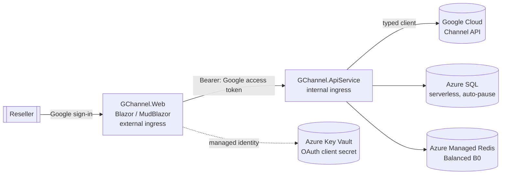

# Architecture

GChannel is built with **.NET Aspire** so the front end and back-end services run as two
independently scalable **Azure Container Apps**, with **Azure SQL (serverless)** storage and
**Azure Managed Redis** caching.

## Solution layout

```
GChannel.slnx                     # solution (root)
azure.yaml                        # azd → Aspire AppHost
src/
  GChannel.AppHost                # Aspire orchestrator: resources + wiring
  GChannel.ServiceDefaults        # OpenTelemetry, health checks, resilience
  GChannel.Shared                 # DTOs/contracts shared by Web + API
  GChannel.ApiService             # Web API + Google Channel client (internal ingress)
  GChannel.Web                    # Blazor (MudBlazor + ApexCharts), Google login (external ingress)
```

## Why two container apps?

`GChannel.Web` (the UI) and `GChannel.ApiService` (the Google integration + data/cache) are
separate Container Apps so they scale independently. The UI is the only one with **external**
ingress; the API service is **internal** and reached over the Container Apps network.

## Diagram



The signed-in user's Google OAuth access token (scope `https://www.googleapis.com/auth/apps.order`)
is forwarded from the Web app to the API service, which uses it to call the Channel API on the
user's behalf.

## Token lifecycle (silent refresh)

Google access tokens expire after ~1 hour. To keep sessions working without forcing re-login, the
Web app requests offline access (`AccessType=offline`) so Google also returns a **refresh token**.
At sign-in the access token, refresh token, and the access token's expiry are stored as claims in
the data-protected authentication cookie.

Before each call to the API service, `GoogleTokenProvider` (in the Web app) returns a valid access
token: it reuses the sign-in token until just before it expires, then silently exchanges the
refresh token for a new access token at Google's token endpoint, caching the result in memory per
user. Only short-lived access tokens are ever forwarded to the API service — the long-lived refresh
token never leaves the Web app, so the API service stays a stateless Bearer-token consumer.

## Secrets

The Google OAuth **client secret** is stored in **Azure Key Vault** and injected into the Web
container app as a Key Vault *secret reference* — the literal value never appears in the
deployment manifest or as plain-text Container Apps configuration. The Web app reads it through
its **managed identity** (granted `Key Vault Secrets User`). Non-secret settings (client id,
reseller account id) are passed as normal parameters/environment variables.

## Resilience &amp; throttling (HTTP 429)

The Channel API enforces per-project quotas, so bursts of reads can return **429 Too Many
Requests**. Two layers keep this graceful:

- **Client-side back-off.** Each `CloudchannelService` is created with a `BackOffHandler` that
  retries `429` (and transient `503`) responses with exponential back-off, up to
  `GoogleChannel:MaxRetryAttempts` (default 3). The library's default 503-only policy is disabled
  in favour of this combined handler.
- **Clean surfacing.** If retries are exhausted, `GoogleApiExceptionHandler` (an `IExceptionHandler`)
  maps the `GoogleApiException` to the same HTTP status (e.g. `429` with a `Retry-After` hint, or
  `403`/`404`) and a `ProblemDetails` body, instead of a generic `500`. A missing access token
  becomes a `401`. The Blazor pages surface these as snackbar errors.

Idempotent reads are also **cached in Redis** (`GoogleChannel:CacheSeconds`, default 300s), so warm
lookups never hit Google — both reducing latency and shrinking the 429 surface.

**Request timeouts.** The shared `AddStandardResilienceHandler` (in `GChannel.ServiceDefaults`) is
configured with a longer **attempt** (60s) and **total-request** (120s) timeout than the framework
default (10s/30s). Calls that fan out to the Channel API can legitimately exceed 30s on a cold start
(credential setup plus exponential back-off retries), so the default would otherwise surface as
*"The operation didn't complete within the allowed timeout of '00:00:30'"*.

**Cloud Identity checks** are additionally **persisted** to Azure SQL (`IdentityCheckLogs`) as an
audit trail. The check endpoint serves the cached result by default; passing `?refresh=true`
(surfaced as the **recheck** button in the UI) bypasses the cache and re-queries Google, then
refreshes the cache. A history endpoint returns the latest result per domain so the UI can show a
"recently checked" list with one-click recheck.

## Catalog correlation &amp; navigation

Catalog resources are cross-linked so a user can pivot between them. The API derives correlation
ids from Google resource names (`products/{product}/skus/{sku}`): a SKU carries its `ProductId`,
and offers/billable-SKUs carry both `SkuId` and `ProductId`. The UI uses these for deep links:

- **Products → Offers** — each SKU row links to `/catalog/offers?sku={skuId}` (offers filtered to
  that SKU).
- **Offers → Products** — the SKU column links to `/catalog/products?product={productId}&sku={skuId}`,
  which auto-expands the product and highlights the SKU.
- **SKU groups → Products / Offers** — each billable SKU links to its product and its offers.

Each table shows the **friendly display name** with the raw id available as a tooltip (and, where a
list previously showed an opaque id such as the Offers page's SKU column, the id is replaced by the
resolved SKU/offer name with the id moved to the tooltip).

This same id-correlation model is the hook for future **customer management** links (e.g. a
customer's entitlements resolving to the products/SKUs/offers shown here).

## Customer management

Customer CRUD is exposed under `/api/customers` (list, get, create `POST`, update `PUT`, delete
`DELETE`). The UI surfaces this as a customers table (`/customers`), a shared create/edit form
(`/customers/new`, `/customers/edit/{id}`), and a detail page (`/customers/{id}`).

- **Cached with invalidation.** Customer list/get are cached in Redis like the catalog reads, but
  because customer data is mutable the cache is **invalidated on every create/update/delete**
  (the list key plus the affected customer key) so the UI never shows stale data after a change.
  Only idempotent purchasable-catalog reads rely on TTL alone.
- **Safe updates.** `UpdateCustomerAsync` sets a field mask
  (`org_display_name,org_postal_address,primary_contact_info,language_code`) so the immutable
  domain and Cloud Identity are never touched; the domain field is disabled in the edit form.
- **Catalog correlation.** The detail page's *Purchasable catalog* section reuses the catalog
  id-correlation model: picking a product lists the customer's purchasable SKUs
  (`listPurchasableSkus`), each of which deep-links to `/catalog/products?product={productId}&sku={skuId}`
  and can expand to its purchasable offers (`listPurchasableOffers`).
- **Cloud Identity cross-link.** The customers table shows whether each customer has a linked Cloud
  Identity (from the `CloudIdentityId` already in the list response — no extra call) and offers a
  per-row **Check** action that deep-links to `/accounts/cloud-identity?domain={domain}`, which
  prefills and runs the check for that domain.

## Entitlement lifecycle

Entitlements (a customer's subscriptions) are the core selling artefact and are nested under a
customer at `/api/customers/{customerId}/entitlements`. The read paths (list, get, change history,
offer lookup) are cached in Redis like the customer reads; every mutation **invalidates** the
affected customer's entitlement caches (list + the specific entitlement's get/changes/offer keys).

- **Pages.** `/customers/{id}/entitlements` lists entitlements with state chips and a state-change
  actions menu; `/customers/{id}/entitlements/{eid}` shows full detail (commitment/renewal, modify
  seats/offer, lifecycle actions, change history); `/customers/{id}/entitlements/new` is the
  purchase flow.
- **Catalog correlation.** Each entitlement carries the provisioned `productId`/`skuId` and backing
  `offerId`, so rows deep-link to `/catalog/offers?sku={skuId}` and
  `/catalog/products?product={productId}&sku={skuId}`. The purchase and *change offer* flows reuse
  the customer's purchasable SKUs/offers (`listPurchasableSkus`/`listPurchasableOffers`) so the
  eligible offer resolves to the same catalog ids.
- **Friendly names.** Entitlements (and their change history) only carry opaque ids, so the API
  enriches them with human-readable **offer / SKU / product** names resolved from the offer catalog
  (a single `offers.list`, reusing the catalog `MarketingInfo.DisplayName`). The UI shows the
  friendly name with the raw id as a tooltip/secondary caption, and falls back to the id if a name
  can't be resolved (the lookup is non-fatal).
- **Typed parameters.** Seat counts are the `num_units` entitlement parameter; the UI sends them as
  a typed `int64` value (`EntitlementParameterInput.IntValue`) on purchase and `changeParameters`.
- **Long-running operations.** Mutating calls (`create`, `changeOffer`, `changeParameters`,
  `changeRenewalSettings`, `activate`, `suspend`, `cancel`, `startPaidService`) return LROs. Full
  operation polling is deferred (roadmap §7); endpoints return `202 Accepted` with an
  `EntitlementOperation` (`OperationName`, `Done`, `Error`). The UI reports *completed* when Google
  finishes inline, otherwise *submitted — processing*, then reloads so the change appears once
  provisioning finishes.

## Home dashboard (derived summary)

The home page (`/`) is backed by a single internal `GET /api/dashboard/summary` endpoint. There is
no Channel API reporting endpoint to call (`accounts.reports.*` / `accounts.reportJobs.*` are
**deprecated** in `v1`), so `GetDashboardSummaryAsync` derives the figures by aggregating the
read paths:

- **Customers** (`accounts.customers.list`) drives the customer count and the *customers onboarded*
  area chart, which buckets customers into the trailing six months by their create time.
- **Entitlements** (per-customer `entitlements.list`) drives the active / trial / suspended counters,
  the active-seat total (`num_units`), and the *product mix* donut (active entitlements grouped by
  product, top 8). Product names are resolved from a product-id→name map seeded from the full
  `products.list` catalog (authoritative, so it covers products whose specific offer is no longer
  listed) and supplemented from `offers.list`, which also yields the offer-id→display map used by the
  entitlement pages. The donut therefore shows friendly names instead of opaque product/sku ids.

The aggregation makes N+1 Channel API calls (customers + per-customer entitlements). The per-customer
entitlement lists run with **bounded parallelism** (`GoogleChannel:DashboardMaxConcurrency`, default 6)
under a **time budget** (35s) that is
kept comfortably below the HTTP client's per-attempt timeout, so the endpoint always responds in time
(and its Redis cache can warm up) instead of being cut off mid-flight and retried. The Channel API
enforces a **per-minute request quota**, so on large estates the burst of `entitlements.list` calls
can return **HTTP 429**; the client retries those with exponential back-off
(`GoogleChannel:MaxRetryAttempts`), but customers whose retries are exhausted within the budget are
reported as failures. Lower `DashboardMaxConcurrency` to reduce 429s (at the cost of fewer customers
reached within the budget), or — the proper fix for large estates — enable the background refresh
below so the dashboard serves a pre-computed, complete result instead of aggregating on the request
path. Customers that
error out (`GoogleApiException`) or aren't reached within the budget are reported via
`SkippedCustomerCount`, which the home page surfaces as an "N customers couldn't be loaded" warning.
The two outcomes are tracked separately and summarised in `IncompleteReason` (e.g. "78 not loaded
within the 35s time budget" vs "3 failed (2× 403 Forbidden, 1× API error)"), which is logged and shown
under the warning so the cause is visible rather than opaque; the rest of the figures are still shown. Throttled `429`s are retried by the shared resilience handler
and the partial aggregates are merged single-threaded. The summary is **cached in Redis** for
`CacheSeconds` (default 300s). The page loads in `OnAfterRenderAsync(firstRender)` (prerender-safe)
behind a loading bar, ties the request to a `CancellationTokenSource` disposed with the component, and
treats `OperationCanceledException` as benign (no error toast on navigation away). Like the other
pages it carries no hardcoded data — empty states render when there are no customers/entitlements.

### Credential source &amp; optional background refresh

`GoogleChannelClient` gets its credential from an injected `IGoogleChannelCredentialSource` rather than
reading the request directly. The default `RequestTokenCredentialSource` (scoped) uses the signed-in
user's forwarded Bearer token. A `ServiceAccountCredentialSource` builds a service-account credential
that impersonates a reseller admin via **domain-wide delegation** (the Channel API has no
service-account identity of its own).

When `GoogleChannel:BackgroundRefreshSeconds` &gt; 0 and a service account + impersonation user are
configured, a hosted `DashboardRefreshService` recomputes the summary off the request path on that
interval and writes it to the same `dashboard:summary` Redis key (with a TTL of twice the interval).
The user endpoint then serves a ready-made, complete result instead of running the slow aggregation
on demand — solving the large-estate case where even the time-budgeted on-demand path returns only a
partial. Because it runs off the HTTP request (no attempt timeout), the background path calls
`GetDashboardSummaryAsync(..., applyTimeBudget: false)` so it runs **unbounded** and produces a
complete result; the 35s budget applies only to the on-demand request path. Because the worker runs
as a hosted service inside the API process, scaling the API to multiple replicas would otherwise have
every replica refresh on its own timer. To keep it
single-flight, each tick first takes a best-effort Redis lock (`dashboard:refresh:lock`, set with
`When.NotExists` and a TTL of one interval); only the replica that wins recomputes, and the key is
left to expire so it doubles as an "already refreshed this interval" marker. The worker is a no-op
(logs and exits) unless fully configured, so on-demand remains the default. Because the unbounded
refresh can outrun its interval on a large estate (the lock set at the start would then expire mid-run
and let the next tick re-run it immediately, saturating the Channel API and starving interactive
calls), a refresh that runs longer than its interval re-arms the lock on completion to enforce at
least one interval of cooldown. See
[configuration.md](configuration.md) for the required Google setup.

## Blazor rendering &amp; request cancellation

The Web app uses **Interactive Server** components with prerendering. A component therefore renders
twice: once during the static prerender pass and again when the interactive circuit connects. Data
loads that run in `OnInitializedAsync`/`OnParametersSetAsync` execute during prerender, and the
in-flight API call is **canceled** when the response is flushed and the page goes interactive —
surfacing as a benign `TaskCanceledException` (innermost `SocketException: "...aborted because of
... an application request"`).

- **Prerender-safe loading.** Data-heavy pages (e.g. the customers list) load in
  `OnAfterRenderAsync(firstRender)` instead, so the API call runs once on the live circuit and the
  canceled prerender request is avoided.
- **Traceable, non-fatal cancellation.** Server-side, these cancellations are caught at the call
  site (e.g. `ListCustomersAsync`), logged at `Debug`, and rethrown — behavior is unchanged and
  ASP.NET Core handles the aborted request normally. The global `GoogleApiExceptionHandler` also
  classifies a client-aborted request (`OperationCanceledException` with `RequestAborted` signalled)
  as **`499 Client Closed Request`** at `Debug` rather than a `500`, so genuine client disconnects
  aren't logged as server errors.

## Local development persistence

The AppHost runs SQL Server and Redis as containers with a **persistent lifetime**
(`ContainerLifetime.Persistent`) and named **data volumes** (`gchannel-sql-data`,
`gchannel-redis-data`; Redis also enables RDB snapshots). The containers therefore stay running and
keep their data **between debug sessions**, so the database isn't re-seeded and the cache stays warm
on each `F5` — which also removes the cold-start latency that previously tripped the request timeout.
To wipe and reseed, remove the volumes: `docker volume rm gchannel-sql-data gchannel-redis-data`.
