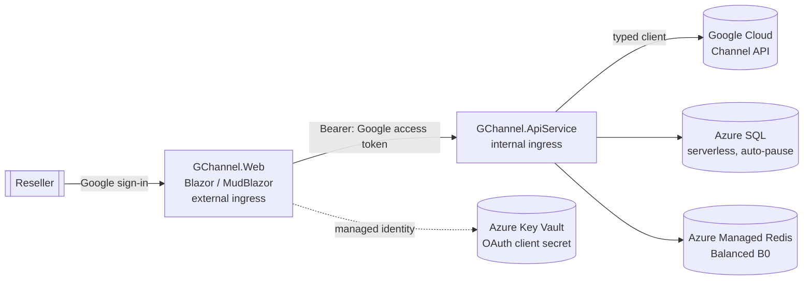

# Architecture

GChannel is built with **.NET Aspire** so the front end and back-end services run as two
independently scalable **Azure Container Apps**, with **Azure SQL (serverless)** storage and
**Azure Managed Redis** caching.

## Solution layout

```
GChannel.slnx                     # solution (root)
azure.yaml                        # azd → Aspire AppHost
src/
  GChannel.AppHost                # Aspire orchestrator: resources + wiring
  GChannel.ServiceDefaults        # OpenTelemetry, health checks, resilience
  GChannel.Shared                 # DTOs/contracts shared by Web + API
  GChannel.ApiService             # Web API + Google Channel client (internal ingress)
  GChannel.Web                    # Blazor (MudBlazor + ApexCharts), Google login (external ingress)
```

## Why two container apps?

`GChannel.Web` (the UI) and `GChannel.ApiService` (the Google integration + data/cache) are
separate Container Apps so they scale independently. The UI is the only one with **external**
ingress; the API service is **internal** and reached over the Container Apps network.

## Diagram



The signed-in user's Google OAuth access token (scope `https://www.googleapis.com/auth/apps.order`)
is forwarded from the Web app to the API service, which uses it to call the Channel API on the
user's behalf.

## Token lifecycle (silent refresh)

Google access tokens expire after ~1 hour. To keep sessions working without forcing re-login, the
Web app requests offline access (`AccessType=offline`) so Google also returns a **refresh token**.
At sign-in the access token, refresh token, and the access token's expiry are stored as claims in
the data-protected authentication cookie.

Before each call to the API service, `GoogleTokenProvider` (in the Web app) returns a valid access
token: it reuses the sign-in token until just before it expires, then silently exchanges the
refresh token for a new access token at Google's token endpoint, caching the result in memory per
user. Only short-lived access tokens are ever forwarded to the API service — the long-lived refresh
token never leaves the Web app, so the API service stays a stateless Bearer-token consumer.

## Secrets

The Google OAuth **client secret** is stored in **Azure Key Vault** and injected into the Web
container app as a Key Vault *secret reference* — the literal value never appears in the
deployment manifest or as plain-text Container Apps configuration. The Web app reads it through
its **managed identity** (granted `Key Vault Secrets User`). Non-secret settings (client id,
reseller account id) are passed as normal parameters/environment variables.

## Resilience &amp; throttling (HTTP 429)

The Channel API enforces per-project quotas, so bursts of reads can return **429 Too Many
Requests**. Two layers keep this graceful:

- **Client-side back-off.** Each `CloudchannelService` is created with a `BackOffHandler` that
  retries `429` (and transient `503`) responses with exponential back-off, up to
  `GoogleChannel:MaxRetryAttempts` (default 3). The library's default 503-only policy is disabled
  in favour of this combined handler.
- **Clean surfacing.** If retries are exhausted, `GoogleApiExceptionHandler` (an `IExceptionHandler`)
  maps the `GoogleApiException` to the same HTTP status (e.g. `429` with a `Retry-After` hint, or
  `403`/`404`) and a `ProblemDetails` body, instead of a generic `500`. A missing access token
  becomes a `401`. The Blazor pages surface these as snackbar errors.

Idempotent reads are also **cached in Redis** (`GoogleChannel:CacheSeconds`, default 300s), so warm
lookups never hit Google — both reducing latency and shrinking the 429 surface.

**Cloud Identity checks** are additionally **persisted** to Azure SQL (`IdentityCheckLogs`) as an
audit trail. The check endpoint serves the cached result by default; passing `?refresh=true`
(surfaced as the **recheck** button in the UI) bypasses the cache and re-queries Google, then
refreshes the cache. A history endpoint returns the latest result per domain so the UI can show a
"recently checked" list with one-click recheck.

## Catalog correlation &amp; navigation

Catalog resources are cross-linked so a user can pivot between them. The API derives correlation
ids from Google resource names (`products/{product}/skus/{sku}`): a SKU carries its `ProductId`,
and offers/billable-SKUs carry both `SkuId` and `ProductId`. The UI uses these for deep links:

- **Products → Offers** — each SKU row links to `/catalog/offers?sku={skuId}` (offers filtered to
  that SKU).
- **Offers → Products** — the SKU column links to `/catalog/products?product={productId}&sku={skuId}`,
  which auto-expands the product and highlights the SKU.
- **SKU groups → Products / Offers** — each billable SKU links to its product and its offers.

This same id-correlation model is the hook for future **customer management** links (e.g. a
customer's entitlements resolving to the products/SKUs/offers shown here).

## Customer management

Customer CRUD is exposed under `/api/customers` (list, get, create `POST`, update `PUT`, delete
`DELETE`). The UI surfaces this as a customers table (`/customers`), a shared create/edit form
(`/customers/new`, `/customers/edit/{id}`), and a detail page (`/customers/{id}`).

- **Cached with invalidation.** Customer list/get are cached in Redis like the catalog reads, but
  because customer data is mutable the cache is **invalidated on every create/update/delete**
  (the list key plus the affected customer key) so the UI never shows stale data after a change.
  Only idempotent purchasable-catalog reads rely on TTL alone.
- **Safe updates.** `UpdateCustomerAsync` sets a field mask
  (`org_display_name,org_postal_address,primary_contact_info,language_code`) so the immutable
  domain and Cloud Identity are never touched; the domain field is disabled in the edit form.
- **Catalog correlation.** The detail page's *Purchasable catalog* section reuses the catalog
  id-correlation model: picking a product lists the customer's purchasable SKUs
  (`listPurchasableSkus`), each of which deep-links to `/catalog/products?product={productId}&sku={skuId}`
  and can expand to its purchasable offers (`listPurchasableOffers`).
