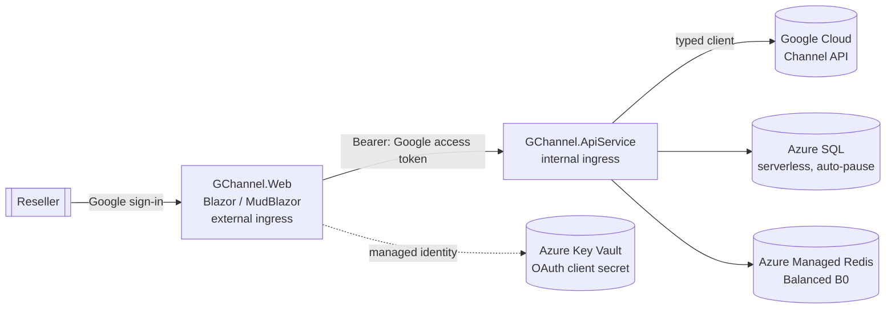

# Architecture

GChannel is built with **.NET Aspire** so the front end and back-end services run as two
independently scalable **Azure Container Apps**, with **Azure SQL (serverless)** storage and
**Azure Managed Redis** caching.

## Solution layout

```
GChannel.slnx                     # solution (root)
azure.yaml                        # azd → Aspire AppHost
src/
  GChannel.AppHost                # Aspire orchestrator: resources + wiring
  GChannel.ServiceDefaults        # OpenTelemetry, health checks, resilience
  GChannel.Shared                 # DTOs/contracts shared by Web + API
  GChannel.ApiService             # Web API + Google Channel client (internal ingress)
  GChannel.Web                    # Blazor (MudBlazor + ApexCharts), Google login (external ingress)
```

## Why two container apps?

`GChannel.Web` (the UI) and `GChannel.ApiService` (the Google integration + data/cache) are
separate Container Apps so they scale independently. The UI is the only one with **external**
ingress; the API service is **internal** and reached over the Container Apps network.

## Diagram



The signed-in user's Google OAuth access token (scope `https://www.googleapis.com/auth/apps.order`)
is forwarded from the Web app to the API service, which uses it to call the Channel API on the
user's behalf.

## Secrets

The Google OAuth **client secret** is stored in **Azure Key Vault** and injected into the Web
container app as a Key Vault *secret reference* — the literal value never appears in the
deployment manifest or as plain-text Container Apps configuration. The Web app reads it through
its **managed identity** (granted `Key Vault Secrets User`). Non-secret settings (client id,
reseller account id) are passed as normal parameters/environment variables.
