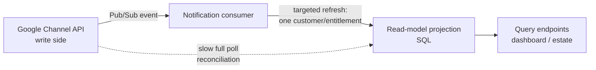

> Part of the [GChannel TODO index](../todo.md).

## 14. CQRS &amp; event-driven projections (architecture note)

> **Status:** ✅ **Implemented** (2026-07) — the two CQRS-adjacent ideas below are now in the codebase:
> **write-through on commands** and **event-driven (Pub/Sub) projections**, both backed by a shared
> `ReadModelProjector`. A *formal* CQRS/MediatR refactor was deliberately **not** done (it would relabel
> an existing design without touching the real constraint — Channel API quota). This note is retained as
> the rationale + design record. See [10 — Persistent read-model](10-persistent-read-model.md).

### What shipped

- **Shared projector** — `GChannel.ApiService/Services/ReadModelProjector.cs` now owns the per-customer
  projection (the `SyncCustomerEntitlementsAsync` core + seat/price/name/renewal/repricing denormalisation
  was **moved out of** `ReadModelSyncService` so there is a single source of truth). The background sync,
  the write-through endpoints and the event projection all call it, so every path denormalises identical
  fields. Registered as a singleton in both `Program.cs` (API + Worker).
- **Write-through on commands** — the direct-customer endpoints (`CustomersEndpoints`) and the n-tier
  partner-customer endpoints (`ChannelPartnerLinksEndpoints`) now upsert the one changed `CustomerRecord`
  immediately after a successful create / import / update, and soft-delete it on delete. Uses the mutation
  result (no extra Channel API call), gated on `UseReadModel`, best-effort (a failure logs and is left for
  the poll to reconcile — never fails the already-successful mutation). Closes the "shows — until next
  sync" gap for the customers/estate/partner-detail lists.
- **Event-driven projection** — `ChannelNotificationsService` now, in addition to recording each Pub/Sub
  event to the feed, triggers a **targeted refresh of the affected customer** (`ReadModelProjector.
  ProjectCustomerAsync`: metadata + all entitlements, priced/named via the per-entitlement `lookupOffer`
  fallback so an empty catalog still resolves everything). It re-reads **live state** rather than applying
  the event payload, so duplicate / out-of-order events converge on current truth; failures never nack
  (that would duplicate the feed entry). The periodic background sync remains the **reconciliation
  backstop**. Requires a service-account credential with domain-wide delegation (built separately from the
  Pub/Sub credential, which may be key-less WIF without DWD), so it activates only when
  `ReadModelSyncEnabled`.
- **Onboarding** — the `AsOfBadge` tooltip now explains the freshness model (your changes appear
  instantly; events refresh within seconds; the timestamp tracks the periodic full sync), and the
  **Notifications** page notes that events also trigger a targeted read-model refresh.

### TL;DR

The app already implements the core of CQRS — a separate, denormalised **read model** (SQL
`CustomerRecords` / `EntitlementRecords` / `ResellerLinks`) physically distinct from the **write side**
(the Google Channel API). Adopting *formal* CQRS (command/query handlers, MediatR, etc.) would mostly
**relabel and reorganise what already exists** and would not touch the real bottleneck (Channel API
quota). The beneficial parts live *near* CQRS, not in the pattern itself.

### What CQRS actually is

**Command Query Responsibility Segregation** makes two independent claims:

1. **Model separation** — the shape you *read* data in need not match the shape you *write* it in.
   Reads hit an optimised projection; writes go through a domain/command model.
2. **(Optional) infrastructure separation** — reads and writes can use different stores, scale
   independently, and update asynchronously (eventual consistency).

CQRS is frequently conflated with **Event Sourcing** (the write model is an append-only event log) and
**MediatR / a command bus** (a code-level dispatch mechanism). Those are separate, optional choices.

### What we already have (de-facto CQRS)

| CQRS concept | Current implementation |
| --- | --- |
| Write model / source of truth | Google Channel API (`create`, `changeOffer`, `provisionCloudIdentity`, repricing, …) |
| Read model / projection | SQL read-model tables, denormalised (`UnitPrice`, `CommitmentEndTime`, `ProductName`, `RenewalEnabled`, `BillableSeats`, …) |
| Projection builder | `ReadModelSyncService` (Worker) |
| Query side | `EstateEndpoints` / `DashboardEndpoints` reading straight from SQL |
| Eventual consistency + freshness marker | Sync rotation + the "As of X ago" badge |

So the question is not *"should we adopt CQRS?"* — the core idea is already adopted. The question is
whether formalising it further, or adopting the event-driven variant, is worth it.

### Where formalising CQRS would help — modestly

The one real code-quality win is **explicit query/command separation** as the surface grows:

- **Queries** (dashboard, estate lists, reseller value) are already read-model-only and side-effect-free
  — they map cleanly onto query handlers.
- **Commands** (create/import customer, change entitlement, repricing) mutate an **external** system and
  the read model only catches up on the next sync cycle. That eventual-consistency gap is the source of
  known UX papercuts (auto-renew showing "—" until re-sync; a link's `CustomerCount` sitting at 0 until
  the fan-out runs).

Formalising commands gives **one obvious place** to close that gap: a command handler that, after a
successful Channel API mutation, does an **optimistic local projection write** (upsert the row it just
created/changed) so the UI reflects it immediately instead of waiting for the worker. This is the
concrete, user-visible benefit — it is really "write-through the read model on command completion".

### Where CQRS would *not* help

- **Event Sourcing is largely off the table.** We do not own the write model — Google does — so we
  cannot make the authoritative store an event log. The classic ES benefits (full audit / temporal
  replay of the source of truth) do not apply. Event-sourcing our *own* local actions is a niche audit
  feature, not a core need.
- **The bottleneck is quota, not model coupling.** The real pain is `ListEntitlements` / `ListCustomers`
  at ~24/min and the poll cadence (hence the pacers, budgets, rotation and stale fallback). CQRS-the-
  pattern buys **zero** extra API calls; reorganising handlers won't change it.
- **Added ceremony.** MediatR + command/query DTOs + handler plumbing is real overhead for a system
  whose read/write split is already clean. At this size it risks being architecture for its own sake.

### The idea that *is* beneficial (adjacent to CQRS): event-driven projections

The app already ingests **Pub/Sub change notifications** (`ChannelNotificationsService`;
entitlement/customer events — see §7). Today those events mostly feed a notifications feed, while the
read model is refreshed by **polling** (stalest-first rotation, throttled by quota).

The CQRS-flavoured upgrade is to treat those Pub/Sub events as **projection triggers**:

Why this is the real win:

- **Freshness without quota burn.** An event names *exactly which* customer/entitlement changed, so we
  re-sync **one row** instead of rotating the whole estate at 24/min. The "As of" lag shrinks sharply
  for the things that actually changed.
- **Poll becomes reconciliation, not primary.** Keep the periodic full sync as a safety net (catch
  missed events), but stop relying on it for timeliness.
- **It fits what we already have.** No new infrastructure — the consumer, the SQL projections and the
  Worker all exist. Note it is the *event-driven projection* that helps, **not** the command/query code
  split.

### Recommendation

1. **Do not** undertake a formal CQRS / MediatR refactor for its own sake — it renames a design that
   already exists and does not touch the real constraint (quota). *(Not done — deliberately.)*
2. **Do** borrow two specific CQRS-adjacent ideas when there's appetite:
   - ✅ **Write-through on commands** — after a successful Channel API mutation, optimistically upsert the
     affected read-model row so the UI updates instantly (closes the "shows — until next sync" gaps).
   - ✅ **Event-driven projections** — promote the Pub/Sub notifications from a feed into **targeted**
     read-model refresh triggers, demoting the poll to a reconciliation backstop. Highest-value,
     best-fit improvement.

Both were **incremental and additive** to the current Worker / read-model design — no big-bang rewrite —
and attack the freshness/quota pain directly rather than the code-organisation cosmetics.

### Sequencing as implemented

1. ✅ **Write-through on commands** (small, isolated): each customer mutation endpoint (direct +
   n-tier partner) upserts the one changed `CustomerRecord` after a successful Channel API call
   (soft-delete on delete), mirroring the metadata fields the worker denormalises, using the mutation
   result — **no** extra API call. Entitlement-level rows follow from the event projection / poll (an
   entitlement create is an LRO, so the row may not exist synchronously — the event covers it).
2. ✅ **Targeted event projection** (medium): `ChannelNotificationsService` routes each change event to a
   per-**customer** refresh (metadata + all its entitlements) via the shared `ReadModelProjector`, which
   **reuses the moved sync core**; the full rotation stays as reconciliation. Duplicate / out-of-order
   events are handled by **re-reading live state** (not applying the event payload) so projections
   converge on current truth (stronger than last-write-by-timestamp); missed events are covered by the
   poll backstop. A per-customer refresh (rather than a single entitlement) also correctly recomputes the
   seat total and soft-deletes cancelled entitlements.
3. ⏭️ **Optional handler organisation** (low priority): still skipped — the command/query surface hasn't
   grown enough to justify an explicit dispatch layer.
